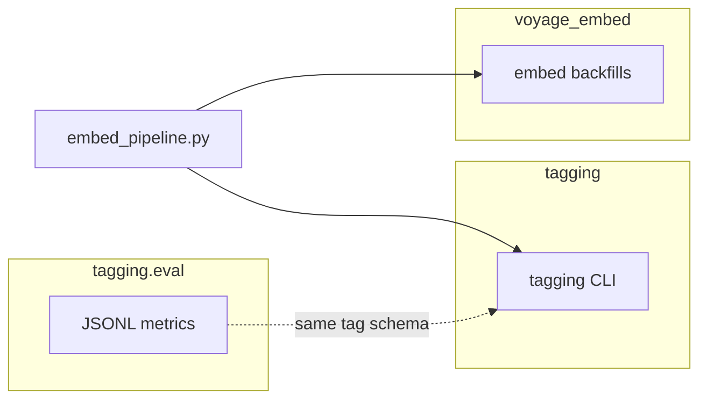

# Bon Voyage: Supabase dev + Voyage embeddings

## Environment variables

| Variable | Purpose |
|----------|---------|
| `SUPABASE_URL_DEV` | Supabase project URL (dev); wins over `SUPABASE_URL` when set |
| `SUPABASE_URL` | Used when `SUPABASE_URL_DEV` is unset |
| `SUPABASE_SERVICE_ROLE_KEY` | **Preferred** API key when set (wins over `SUPABASE_KEY` if both are set) |
| `SUPABASE_KEY` | Fallback key; use **service role** for `UPDATE` on `tracks_ai` (publishable keys often cannot write) |
| `VOYAGE_API_KEY` | [Voyage API key](https://docs.voyageai.com/docs/api-key-and-installation) |
| `VOYAGE_MODEL` | Optional; default `voyage-3.5-lite` |
| `VOYAGE_INPUT_TYPE` | Optional; default `document` (use `query` for search queries only) |
| `VOYAGE_OUTPUT_DIMENSION` | Optional; set to match your pgvector column width if the model supports it (e.g. matryoshka). If omitted, the model’s default dimension is used. |
| `VOYAGE_VECTOR_COLUMN` | Optional; default `voyage_ai_embedding`. Voyage vectors are stored here; legacy OpenAI vectors stay in `embedding`. Rows are selected where this column `IS NULL` until filled. |
| `VOYAGE_MAX_RETRIES` | Optional; default `3` |
| `VOYAGE_TIMEOUT` | Optional; seconds |
| `DATABASE_URL` | Optional. **Postgres connection URI** (Supabase: **Settings → Database**). If set, embedding **writes** use direct SQL and **bypass PostgREST** (fixes stubborn `UPDATE … affected 0 rows` when the HTTP API does not apply updates). Same names supported: `SUPABASE_DATABASE_URL`, `POSTGRES_URL`. Requires `psycopg` (`pip install 'psycopg[binary]'`). Prefer the **Connection pooling** URI (pooler host, port **6543**) if **direct** (port **5432**) fails with IPv6 / “No route to host” on your network. |
| `GOOGLE_CLOUD_API_KEY` | **Vertex AI (Gemini) tagging:** API key for `genai.Client(vertexai=True, api_key=…)` when not using project/location + ADC. |
| `GOOGLE_CLOUD_PROJECT` | Optional; with `GOOGLE_CLOUD_LOCATION`, use Vertex via project/location instead of API key. |
| `GOOGLE_CLOUD_LOCATION` | Optional; e.g. `us-central1`. |
| `GOOGLE_GENAI_USE_VERTEXAI` | Optional; set to `true` to force Vertex mode when using project/location env vars. |
| `GEMINI_TAG_MODEL` | Optional; default `gemini-2.0-flash-lite` (override with any supported Vertex model id). |
| `TAG_PROMPT` | Optional; which prompt module to load: `prompt_1`, `prompt_2`, … (files under `tagging/prompts/`). Default `prompt_1`. Overridden by `--prompt` / `--tag-prompt`. |

Place values in **`.env`** at the repo root. Scripts call `load_dotenv()` for that file so you do not need to `export` manually.

**Debug credentials:** from the repo root, run `python embed_pipeline.py check-env`. It prints which URL and key variables win, the JWT `role` (should be `service_role` for batch writes), and the project `ref` — without printing secrets.

### Edge function `search-music` (Voyage query embeddings)

The deployed function [`supabase/functions/search-music`](supabase/functions/search-music) embeds the user query with **Voyage** (`input_type` defaults to **`query`** for retrieval; override with Edge secret `VOYAGE_INPUT_TYPE` if needed). Set these in **Supabase Dashboard → Edge Functions → Secrets** (not only `.env` on your laptop):

- **`VOYAGE_API_KEY`** (required)
- **`VOYAGE_MODEL`** — optional; default `voyage-3.5-lite` (same default as Python `voyage_embed/env.py`)
- **`VOYAGE_OUTPUT_DIMENSION`** — optional; must match your pgvector column width when using matryoshka (e.g. `1024`)
- **`SUPABASE_URL`** / **`SUPABASE_SERVICE_ROLE_KEY`** — usually auto-injected

**Before production:** Apply [`supabase/sql_functions_local/search_music_voyage.sql`](supabase/sql_functions_local/search_music_voyage.sql) so Postgres has `search_music_voyage(query_embedding vector(1024))` using `voyage_ai_3p5_embed`. The Edge function calls that RPC (legacy `search_music` remains for rollback).

**Deploy:** `supabase functions deploy search-music` (CLI linked to the target project).

If the mobile app branches on error `code`, update any check for `missing_openai_key` to **`missing_voyage_key`**.

## Pipeline layout (tagging → embedding → eval)

| Piece | Role |
|-------|------|
| [`tagging/`](tagging/) | Vertex Gemini tagging → `tracks_ai` (`python -m tagging` or `embed_pipeline.py tag-tracks`) |
| [`voyage_embed/`](voyage_embed/) | Voyage embeddings and DB backfills for tracks, artists, playlists |
| [`tagging/eval/`](tagging/eval/) | Offline JSONL comparison (`python -m tagging.eval`) — no Voyage calls |
| [`embed_pipeline.py`](embed_pipeline.py) | Orchestrates tagging and/or embedding steps from the repo root |



### Troubleshooting: “Processed N” but nothing in the database

- **RLS:** Batch scripts need an API key that is allowed to `UPDATE` these tables. Prefer **`SUPABASE_SERVICE_ROLE_KEY`** (or `SUPABASE_KEY` set to the service role secret). Publishable/anon keys often can read but not write.
- **Wrong project:** Confirm `SUPABASE_URL_DEV` matches the project you have open in the dashboard.
- **`UPDATE … affected 0 rows` (PostgREST):** If `check-env` shows `service_role` but PATCH still updates zero rows, set **`DATABASE_URL`** to the **database password** connection string from the dashboard and rerun — writes will use Postgres directly while reads still use the Supabase client.
- After a failed write, the embedder **raises** if PostgREST returns zero updated rows (instead of only incrementing a counter).

### Billing and rate limits

Without a payment method on the Voyage dashboard, accounts are limited to very low RPM. Add a payment method at [dashboard.voyageai.com](https://dashboard.voyageai.com/) for standard limits, or use **`--sleep-seconds`** (e.g. `20`) between batches when testing.

### Parallel Voyage requests

Use **`--embed-workers N`** (default `1`) to run up to `N` concurrent **chunk** embed calls in a thread pool. Each iteration loads **`batch-size × embed-workers`** rows so there are enough texts to split into multiple API chunks. Higher `N` increases throughput until you hit **rate limits** (429); reduce `N` or add **`--sleep-seconds`** if that happens.

## Tag tracks (Vertex Gemini) before embeddings

Apply migration [`supabase/migrations/20260419120000_tagging_runs.sql`](supabase/migrations/20260419120000_tagging_runs.sql) in the Supabase SQL editor (creates `tagging_runs` and `tracks_ai.tagging_run_id`).

- **Tag pending rows** (`tagging_status = 'pending'`):  
  `python embed_pipeline.py tag-tracks --limit 10`  
  Use another prompt file: `python embed_pipeline.py tag-tracks --tag-prompt prompt_1 --limit 10` (or set `TAG_PROMPT` in `.env`).
- **Dry run:** `python embed_pipeline.py tag-tracks --dry-run --limit 5`
- **Then embed:** `python embed_pipeline.py embed-tracks --limit 10`
- **Combined:** `python embed_pipeline.py embed-all --tag-tracks-first --tag-limit 10` (runs tagging, then all three embed steps; use `--tag-dry-run` to skip real Gemini calls for a smoke test of the pipeline shape).

Playlist context comes from `track_playlist_map` → `playlists_ai` (first row by `position`). Legacy CSV batch tagging remains in [`music-tagging/tag_tracks_batch.py`](music-tagging/tag_tracks_batch.py) (OpenAI Batch). That script imports the shared schema from [`tagging/prompt.py`](tagging/prompt.py).

**Eval (reference vs candidate JSONL):**

```bash
python -m tagging.eval --reference-jsonl ref.jsonl --candidate-jsonl cand.jsonl
```

Each line must be one JSON object per line with `track_id`. The **reference** file should include `reference` (or `tags` / `prediction` as fallback) for ground truth; the **candidate** file should include `prediction` (or `tags`). For list fields (`style_tags`, `mood_keywords`, `search_keywords`, `secondary_genres`), values are compared after **strip + lower** per token.

Optional output directory (writes `metrics.json`, `summary.txt`, `genre_confusion.csv`; add `--plot` for heatmaps under `plots/`):

```bash
python -m tagging.eval --reference-jsonl ref.jsonl --candidate-jsonl cand.jsonl \
  --out-dir eval_out --genre-top-k 30 --plot
```

Flags: `--genre-max-labels` (classification report size), `--genre-confusion-csv PATH`, `--plot-max-labels` (skip large genre heatmaps), `--quiet` (stdout suppressed when using `--out-dir`). Default is print-only to stdout, same as before.

Previously: `python -m voyage_embed.track_tagging.eval_cli` — use `python -m tagging.eval` instead.

## Verify pgvector column width

Before a full backfill, confirm the `vector(N)` dimension in Supabase matches your Voyage output (or set `VOYAGE_OUTPUT_DIMENSION` if supported for your model):

```sql
SELECT column_name, data_type, udt_name
FROM information_schema.columns
WHERE table_schema = 'public' AND table_name = 'tracks_ai'
  AND column_name IN ('embedding', 'voyage_ai_embedding');
```

**Important:** The embed scripts fill **`voyage_ai_embedding`** (or `VOYAGE_VECTOR_COLUMN`), not `embedding`. If almost every row already has OpenAI in `embedding`, a filter on `embedding IS NULL` would only return the rare row still missing OpenAI—use the Voyage column for backfill progress instead.

If the stored dimension does not match, alter the column or pick a different `VOYAGE_MODEL` / `VOYAGE_OUTPUT_DIMENSION` per [Voyage embeddings docs](https://docs.voyageai.com/docs/embeddings).

## Workflow

### 1. EDA (read-only)

```bash
cd /path/to/bon-voyager
python embed_pipeline.py eda --table tracks_ai --sample 20
python embed_pipeline.py eda --table playlists_ai --sample 20
```

Or run `python sbase_embeddings_rerun.py` with the same flags.

### 2. Smoke test (few rows)

```bash
python embed_pipeline.py embed-tracks --limit 5 --dry-run
python embed_pipeline.py embed-tracks --limit 5
```

### 3. Full Voyage backfill (parallel to OpenAI `embedding`)

Embeds rows where **`voyage_ai_embedding` is null**; OpenAI **`embedding`** is unchanged.

To **recompute** Voyage vectors for everyone (including rows that already have `voyage_ai_embedding`), use **`--replace-all`** (optionally with `--limit` for tests).

```bash
python embed_pipeline.py embed-tracks --replace-all --sleep-seconds 0
```

### 4. All tables (tracks, then artists, then playlists)

```bash
python embed_pipeline.py embed-all --limit 10
```

### 5. Track universe plot (2D t-SNE)

Full detail: [VISUALIZATION.md](VISUALIZATION.md) (outputs, caching, `viz` subcommand).

Requires `scikit-learn`, `matplotlib`, and for **interactive** output **`plotly`**:

```bash
pip install scikit-learn matplotlib plotly
```

**Static PNG** (colored by KMeans clusters + keyword hints printed to the terminal):

```bash
python sbase_embeddings_rerun.py --table tracks_ai --sample 1500 \
  --plot-universe tracks_universe.png --embedding-column voyage_ai_3p5_embed
```

**Interactive HTML** (zoom/pan, hover shows title/artist/tags/id; open the file in a browser):

```bash
python embed_pipeline.py eda --sample 1500 \
  --plot-universe tracks_universe.html --embedding-column voyage_ai_3p5_embed
```

**D3 HTML** (zoom/pan, text filter, sidebar cluster keywords; no extra Python deps beyond sklearn):

```bash
python embed_pipeline.py eda --sample 1500 \
  --plot-universe tracks_universe.html \
  --d3-universe tracks_universe_d3.html \
  --embedding-column voyage_ai_3p5_embed
```

**Cache the sample** so you can re-run plots without pulling rows from Supabase each time. The JSON file is written on first use (or when you **`--refresh-cache`**):

```bash
mkdir -p viz
python embed_pipeline.py eda --sample 1500 \
  --sample-cache viz/tracks_ai_sample_1500.json \
  --plot-universe tracks_universe.html \
  --d3-universe tracks_universe_d3.html \
  --embedding-column voyage_ai_3p5_embed
# Later (offline from Supabase for the sample step):
python embed_pipeline.py viz --from-cache viz/tracks_ai_sample_1500.json \
  --d3 tracks_universe_d3.html --plotly tracks_universe.html
```

Optional: **`--plot-clusters K`** to fix the number of KMeans clusters (default is automatic). Use a smaller **`--sample`** if PostgREST hits a statement timeout.

**Semantic search (Voyage query vs cached vectors)** — for analysis only, e.g. `python embed_pipeline.py search --from-cache viz/sample.json --embedding-column voyage_ai_3p5_embed "chill vibes"`, or `viz ... --search "..."` with Plotly/D3. **Live search in the browser** (no API key in JS): `python embed_pipeline.py cosmos --cache viz/tracks_sample_1500.json --embedding-column …` then open http://127.0.0.1:8765/ . See [VISUALIZATION.md](VISUALIZATION.md#semantic-search-natural-language-vs-cached-vectors).

### 6. Backfill validation

- Re-run EDA or spot-check rows in Supabase.  
- Run nearest-neighbor queries in SQL or your app.  
- If similarity quality is wrong, confirm `combined_tags` text and `VOYAGE_MODEL` / dimensions.

## music-tagging scripts

Legacy CLIs under `music-tagging/` load the parent `.env` and call the same `voyage_embed` embedding modules (tagging uses the top-level [`tagging`](tagging/) package):

```bash
python music-tagging/generate_embeddings.py --limit 10
python music-tagging/generate_artist_embeddings.py --limit 10
python music-tagging/generate_playlist_embeddings.py --limit 10
```

See [music-tagging/README.md](music-tagging/README.md) and [music-tagging/EMBEDDINGS.md](music-tagging/EMBEDDINGS.md) for context.
